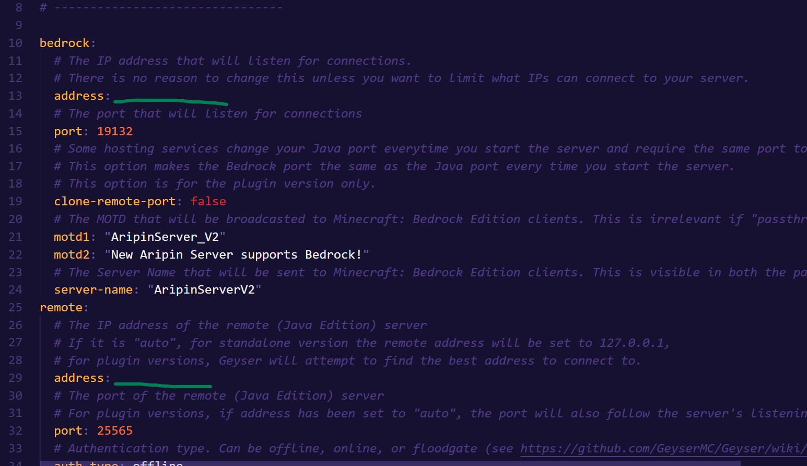

# Aripin_Server_V2
Aripin's Minecraft community project aiming to make Java and Bedrock cross-playable using GeyserMC!

## FAQs
#### What is this repository for?
- Since Project Geyser is community-driven, this serves as a guide for those who want to contribute to the Aripin's Server.
- The server file will be available below.
- For those who want to moderate this repository, feel free to contact me!

## Server Folder Link
- https://mega.nz/folder/xcc3UQpZ#-tcUbuS03YIhNF6MQYG-Xw

## Important Bits
#### Running the server
- You just have to click the `run.bat` file, it has all the optimizations required to run the server smoothly.
- To stop the server, just enter `stop`
- To join the server, enter the `ip-address:port`; use ports `25565` for Java or `19132` for Bedrock. (Example: `192.168.1.1:25565` `192.168.1.1:19132`)
#### Versions
- This is just a backup for the previous server.jar versions
#### Server.properties
- `server-ip= <put your host IP or your ZeroTier One IP (if you're planning to use that)>`
#### plugins/Geyser-Spigot/config.yml
- There should be two places where you need to put the same host IP, one for BEDROCK and one for REMOTE
- `address= <the host IP goes here>` 

#### (Optional) ZeroTier One
- If you plan to host a virtual network using ZeroTier One, here's a tutorial: https://www.youtube.com/watch?v=oTlxwg3atBc
